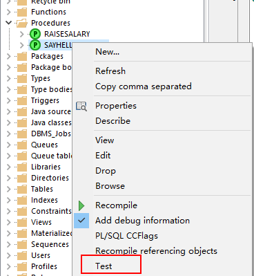
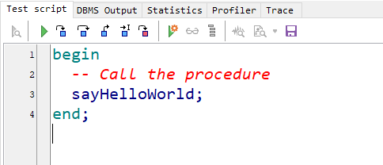
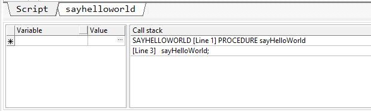

# 存储过程或存储函数

&emsp;&emsp;存储在数据库中供所有用户程序调用的子程序叫存储过程或存储函数。

&emsp;&emsp;存储过程和存储函数的相同点：完成特定功能的程序；

&emsp;&emsp;存储过程和存储函数的区别：是否用RETURN语句返回值，存储函数可以通过return语句返回值。

<br/>

## 一、存储过程

创建和使用存储过程，最简化的语法：

```plsql
CREATE [OR REPLACE] PROCEDURE 过程名（参数列表）

AS

PLSQL程序体;
```

<br/>

**第一个存储过程：**

```plsql
-- 第一个存储过程：打印 HELLO WORLD
CREATE OR REPLACE PROCEDURE sayHelloWorld
AS
  -- 相当于 PLSQL块中的 DECLARE 声明部分
BEGIN
  dbms_output.put_line('HELLO WORLD!!');
END;

/**
调用存储过程：
1、exec sayHelloWorld();
2、在另一个存储过程中调用
begin
  sayHelloWorld();
  sayHelloWorld();
end;
**/

begin
  sayHelloWorld();
  sayHelloWorld();
end;
```

<br/>

**带参数的存储过程：**

```plsql
-- 带参数的存储过程
/**
注意：在该存储过程中更新了表数据，但是不需要使用事务 commit
**/
-- 给指定的员工涨100元工资，并且打印涨前和涨后的工资
CREATE OR REPLACE PROCEDURE raiseSalary(eno in number)
AS
  -- 定义一个变量保存涨前的薪水
  psal emp.sal%type;
BEGIN
  SELECT sal INTO psal FROM emp WHERE empno = eno;
  
  -- 注意：一般不在存储过程和存储函数中，commit 和 rollback，事务控制交给调用者
  UPDATE emp SET sal = sal + 100 WHERE empno = eno;

  dbms_output.put_line('涨前薪水：' || psal || '，涨后薪水：' || (psal + 100));
END;


BEGIN
  -- 在这里提交，要保证两个人同时涨工资，这也解释了为什么一般不在存储过程里面做事务控制
  raiseSalary(7839);
  raiseSalary(7566);
  COMMIT;
END;
```

<br/>

&emsp;&emsp;如何使用PLSQL Developer 调试存储过程，Oracle用户scott用户调试存储过程，需要有Debug的权限，所以登录到sys用户，为scott用户授权：

```plsql
grant dba to scott;  -- 也可以就授予Debug的权限
```







<br/>

## 二、存储函数

&emsp;&emsp;函数（Function）为一命名的存储程序，可带参数，并返回一计算值。函数和存储过程结构类似，但必须有一个RETURN子句，用于返回函数值。

存储函数的简化语法：

```plsql
CREATE [OR REPLACE] FUNCTION 函数名（参数列表）

RETURN 函数值类型

AS

PLSQL 子程序;
```

<br/>

**第一个例子：查询员工的年薪**

```plsql
-- 存储函数：查询某个员工的年收入
CREATE OR REPLACE FUNCTION queryEmpIncome(eno IN NUMBER)
RETURN NUMBER
AS
  -- 定义变量保存员工的薪水和奖金
  psal emp.sal%type;
  pcomm emp.comm%type;
BEGIN
  -- 得到该员工的月薪与奖金
  SELECT sal, comm into psal, pcomm FROM emp WHERE empno = eno;
  
  -- 直接返回年收入
  RETURN psal * 12 + nvl(pcomm, 0);
END;


/*
  调用存储函数的几种方法：
  在 PLSQL 块中：
  1、SELECT queryEmpIncome(7839) INTO income FROM dual;
  2、income := queryEmpIncome(7839);
  
  在 SQL 命令行中：
  3、call
  variable income number
  call queryEmpIncome(7902) into :income; -- 需要 分号，需要 冒号
  
  4、execute
  variable income number
  execute :income := queryEmpIncome(7902);
  
  5、将函数作为另一个子程序的参数：execute dbms_output.put_line(queryEmpIncome(7902));
*/
DECLARE
  income number;
BEGIN
  -- SELECT queryEmpIncome(7839) INTO income FROM dual;
  -- income := queryEmpIncome(7839);
  execute income := queryEmpIncome(7902);
  dbms_output.put_line('income = ' || income);
END;
```

<br/>

&emsp;&emsp;一般来讲，存储过程和存储函数的区别在于存储函数可以有一个返回值；而存储过程没有返回值。

&emsp;&emsp;过程和函数都可以通过out指定一个或多个输出函数。我们可以利用out参数，在过程和函数中实现返回多个值。

- &emsp;&emsp;存储过程和存储函数都可以有out参数；
- &emsp;&emsp;存储过程和存储函数都可以有多个out参数；
- &emsp;&emsp;存储过程可以通过out参数来实现返回值。

&emsp;&emsp;原则上：如果只有一个返回值，则使用存储函数；否则，就用存储过程。

<br/>

**OUT参数的使用**

```plsql
-- out 参数的使用。查询某个员工姓名 月薪和职位
CREATE OR REPLACE PROCEDURE queryEmpInform(eno IN NUMBER, 
       pname OUT VARCHAR2, psal OUT NUMBER, pjob OUT VARCHAR2)
AS
BEGIN
  -- 得到员工的姓名，月薪和职位
  SELECT ename, sal, job INTO pname, psal, pjob FROM emp WHERE empno = eno;
  
  -- 如果要返回员工的所有信息呢，总不能写很多个 OUT 参数吧（参数太多）
  -- 如果要返回一个部门的所有员工的所有信息 ---> 在 OUT 中返回集合？
END;
/

SELECT * FROM emp;

DECLARE
  pname emp.ename%type;
  psal emp.sal%type;
  pjob emp.job%type;
BEGIN
  queryEmpInform(7839, pname, psal, pjob);
  dbms_output.put_line('pname = ' || pname || ', psal = ' || psal || ', pjob = ' || pjob);
END;
```

<br/>

## 三、在应用程序中访问存储过程和存储函数

完整代码地址：https://github.com/zengxt/oracle-base/tree/master

JDBCUtils

```java
import lombok.extern.slf4j.Slf4j;

import java.sql.Connection;
import java.sql.DriverManager;
import java.sql.ResultSet;
import java.sql.SQLException;
import java.sql.Statement;

@Slf4j
public class JDBCUtils {
    private static String driver = "oracle.jdbc.OracleDriver";
    private static String url = "jdbc:oracle:thin:@localhost:1521:orcl";
    private static String user = "scott";
    private static String password = "admin";

    /**
     * 注册数据库驱动
     */
    static {
        try {
            Class.forName(driver);
        } catch (ClassNotFoundException ex) {
            log.error("找不到驱动类：{}", ex.getMessage());
        }
    }

    /**
     * 获取数据库连接
     *
     * @return Connection
     */
    public static Connection getConnection() {
        try {
            return DriverManager.getConnection(url, user, password);
        } catch (SQLException ex) {
            log.error("获取数据库连接失败：{}", ex.getStackTrace());
        }
        return null;
    }

    /**
     * 资源释放
     *
     * @param conn
     * @param statement
     * @param resultSet
     */
    public static void release(Connection conn, Statement statement, ResultSet resultSet) {
        if (resultSet != null) {
            try {
                resultSet.close();
            } catch (SQLException ex) {
                log.error("关闭ResultSet失败：{}", ex.getStackTrace());
            }
        }

        if (statement != null) {
            try {
                statement.close();
            } catch (SQLException ex) {
                log.error("关闭Statement失败：{}", ex.getStackTrace());
            }
        }

        if (conn != null) {
            try {
                conn.close();
            } catch (SQLException ex) {
                log.error("关闭Connection失败：{}", ex.getStackTrace());
            }
        }
    }
}
```

### 1、调用存储过程

```java
@Test
public void testCallProcedure() {
    String sql = "{call queryEmpInform(?, ?, ?, ?)}";
    Connection conn = null;
    CallableStatement call = null;
    try {
        conn = JDBCUtils.getConnection();
        call = conn.prepareCall(sql);

        // 对于in参数，需要赋值
        call.setInt(1, 7839);

        // 对于out参数，声明
        call.registerOutParameter(2, OracleTypes.VARCHAR);
        call.registerOutParameter(3, OracleTypes.NUMBER);
        call.registerOutParameter(4, OracleTypes.VARCHAR);

        // 执行调用
        call.execute();

        // 取出结果
        String pname = call.getString(2);
        double psal = call.getDouble(3);
        String pjob = call.getString(4);
        System.out.println("[pname = " + pname + ", psal = " + psal + ", pjob = " + pjob + "]");
    } catch (Exception ex) {
        log.error("调用存储过程失败：{}", ex.getStackTrace());
    } finally {
        JDBCUtils.release(conn, call, null);
    }
}
```

<br/>

### 2、调用存储函数

```java
@Test
public void testCallFunction() {
    String sql = "{?=call queryEmpIncome(?)}";
    Connection conn = null;
    CallableStatement call = null;
    try {
        conn = JDBCUtils.getConnection();
        call = conn.prepareCall(sql);

        // 对于out参数，声明
        call.registerOutParameter(1, OracleTypes.NUMBER);
        // 对于in参数，需要赋值
        call.setInt(2, 7839);
        // 执行调用
        call.execute();

        // 取出结果
        double income = call.getDouble(1);
        System.out.println("该员工的年收入为：" + income);
    } catch (Exception ex) {
        log.error("调用存储函数失败：{}", ex.getStackTrace());
    } finally {
        JDBCUtils.release(conn, call, null);
    }
}
```

<br/>

## 四、PACKAGE && PACKAGE BODY

1、包头声明包中的结构

```plsql
CREATE OR REPLACE PACKAGE mypackage AS
	type empcursor is ref cursor;
	procedure queryEmpList(dno in number, empList out empcursor);
END mypackage;
```

2、包体定义（需要实现包头中声明的所有方法）

```plsql
CREATE OR REPLACE PACKAGE BODY mypackage AS
	PROCEDURE queryEmpList(dno in number, empList out empcursor) AS
	BEGIN
		-- 使用光标作为out参数也解决了需要返回多个变量的问题
		OPEN empList FOR SELECT * FROM emp WHERE deptno = dno;
	END queryEmpList;
END mypackage;
```


